# Job Development

This page provides an overview of job development in Blazor Data Orchestrator — what a job is, how it is structured, and the two development approaches available.

---

## What is a Job?

A **job** is a unit of work packaged as a NuGet package (`.nupkg`). Each package contains code files, configuration, and dependency metadata. When a job is triggered, the Agent downloads the package from Azure Blob Storage, extracts it, resolves dependencies, and executes the code.

---

## Supported Languages

| Language | Entry Point | Execution Method |
|----------|------------|------------------|
| **C#** | `BlazorDataOrchestratorJob.ExecuteJob()` in `main.cs` | Compiled and executed via CS-Script/Roslyn |
| **Python** | `execute_job()` function in `main.py` | Executed via Python subprocess |

The language is set via the `SelectedLanguage` field in `configuration.json` inside the NuGet package (valid values: `CSharp` or `Python`).

---

## Package Structure

```
BlazorDataOrchestrator.Job.1.0.nupkg
├── BlazorDataOrchestrator.Job.nuspec        # Package manifest with dependencies
└── contentFiles/
    └── any/
        └── any/
            ├── configuration.json            # Language and settings
            ├── main.cs (or main.py)          # Primary code file
            ├── additional-file.cs            # Optional additional code files
            ├── appsettings.json              # Default configuration
            ├── appsettingsProduction.json    # Production overrides
            └── appsettingsStaging.json       # Staging overrides (optional)
```

---

## Job Execution Pipeline

```mermaid
sequenceDiagram
    autonumber
    participant Trigger as ⚡ Trigger<br/>(Schedule / Manual / Webhook)
    participant Web as 💻 Web App
    participant Queue as 📨 Azure Queue
    participant Agent as 🤖 Agent Worker
    participant Blob as 📄 Blob Storage
    participant Code as 📜 Job Code

    Trigger->>Web: Initiate job run
    Web->>Web: Create JobInstance record
    Web->>Queue: Send JobQueueMessage
    Agent->>Queue: Receive message
    Agent->>Blob: Download .nupkg
    Agent->>Agent: Extract & validate package
    Agent->>Agent: Resolve NuGet dependencies
    Agent->>Agent: Load appsettings for environment
    Agent->>Code: Execute main.cs / main.py
    Code-->>Agent: Execution logs
    Agent->>Agent: Update JobInstance status
```



---

## C# Job Template

A minimal C# job looks like this:

```csharp
using System;

public class BlazorDataOrchestratorJob
{
    public static void ExecuteJob()
    {
        Console.WriteLine("Hello from Blazor Data Orchestrator!");
        // Your job logic here
    }
}
```

### Adding NuGet Dependencies

Declare dependencies in the `.nuspec` file:

```xml
<?xml version="1.0" encoding="utf-8"?>
<package>
  <metadata>
    <id>BlazorDataOrchestrator.Job</id>
    <version>1.0.0</version>
    <description>My job package</description>
    <authors>Author</authors>
  </metadata>
  <dependencies>
    <dependency id="Newtonsoft.Json" version="13.0.3" />
    <dependency id="Dapper" version="2.1.35" />
  </dependencies>
</package>
```

Dependencies are resolved automatically at execution time via `dotnet restore`. Transitive dependencies are included.

You can also use CS-Script syntax in- code for quick dependency references:

```csharp
//css_nuget Newtonsoft.Json
```

---

## Python Job Template

A minimal Python job:

```python
def execute_job():
    print("Hello from Blazor Data Orchestrator!")
    # Your job logic here

execute_job()
```

Python dependencies can be listed in a `requirements.txt` file within the package.

---

## Environment-Specific Configuration

Jobs can include per-environment configuration files. The Agent loads the appropriate file based on the job's `JobEnvironment` setting:

| Environment | Config File |
|-------------|-------------|
| Development (default) | `appsettings.json` |
| Production | `appsettingsProduction.json` |
| Staging | `appsettingsStaging.json` |

The Agent also merges its own connection strings into the job's configuration at runtime, so jobs can access shared infrastructure (database, storage, etc.) without hardcoding credentials.

---

## Development Options

Choose the approach that best fits your workflow:

| Approach | Description | Best For |
|----------|-------------|----------|
| **[Online Editor](https://github.com/Blazor-Data-Orchestrator/BlazorDataOrchestrator/wiki/Online)** | Write code directly in the browser using the Monaco editor | Quick edits, simple jobs, no local tooling needed |
| **[Visual Studio](https://github.com/Blazor-Data-Orchestrator/BlazorDataOrchestrator/wiki/Visual-Studio)** | Develop jobs locally using the Job Creator Template project | Complex jobs, full IDE support, debugging |

---

*Back to [Home](https://github.com/Blazor-Data-Orchestrator/BlazorDataOrchestrator/wiki/Home)*
