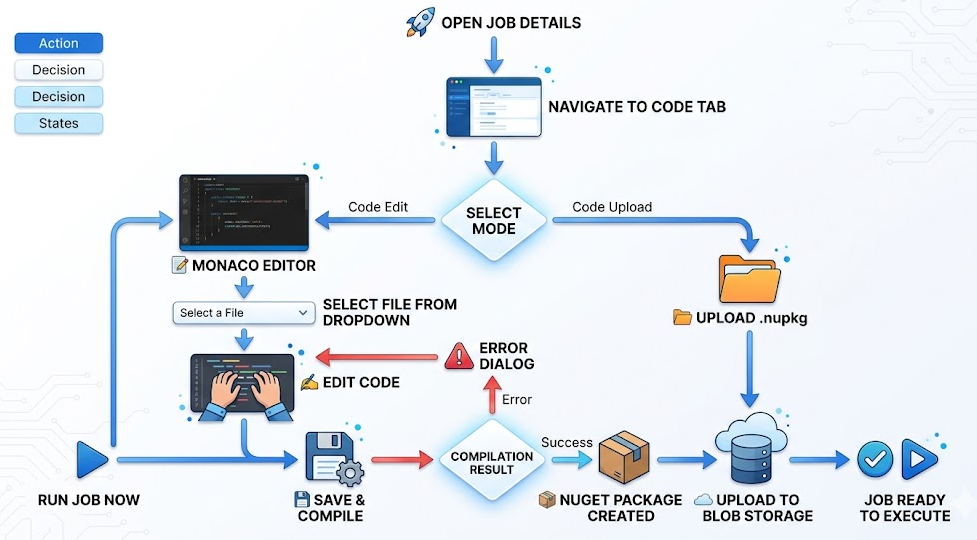
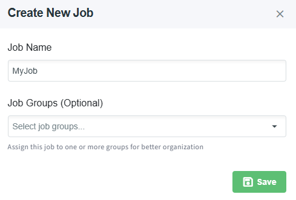
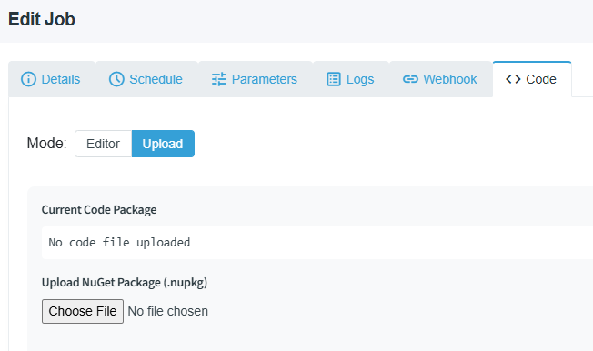
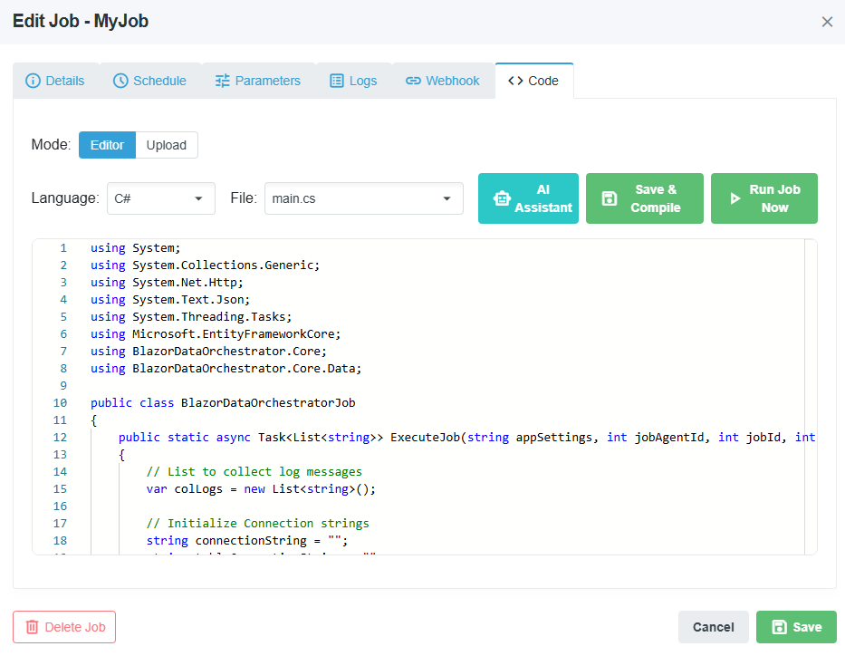
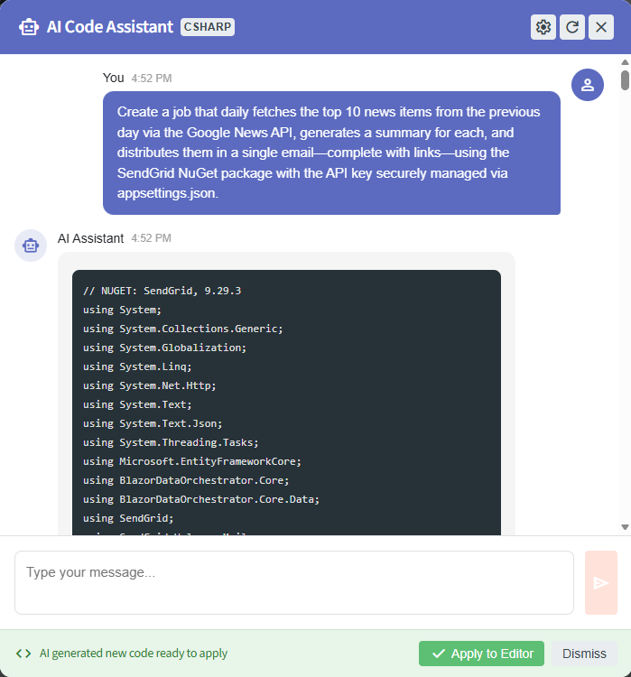

# Online Code Editor

The online code editor allows you to write, compile, and deploy jobs directly in your browser — no local tooling required beyond a web browser. Write a C# or Python job, hit compile, and have it running on Azure in minutes.

---

## Overview



The editor is embedded in the **Code Tab** of the Job Details dialog. It uses the [Monaco Editor](https://microsoft.github.io/monaco-editor/) (the same editor that powers Visual Studio Code) and supports both `C#` and `Python`. Combined with the AI Code Assistant, it provides a complete development environment for automation jobs without any local setup.


---

## Create A New Job


To create a new job click the `Create New Job` button.



Give the job a name and click the `Save` button.

## UI Modes



Click the `Code` tab. The `Code` tab has two modes:

| Mode | Description |
|------|-------------|
| **Editor** | Write and edit code in the Monaco editor |
| **Upload** | Upload a pre-built `.nupkg` file. Create this file by saving code created with the `Editor` or using the [Visual Studio](https://github.com/Blazor-Data-Orchestrator/BlazorDataOrchestrator/wiki/Visual-Studio) project.  |

---

## Editor




In **Editor** mode, the `Languge` dropdown allows you to switch beteen coding in `C#` or `Python`. The `File` dropdown lists all files in the job package. You can switch between files to edit them.

### C# Job Files

| File | Purpose |
|------|---------|
| `main.cs` | Primary code file with the `ExecuteJob()` entry point |
| `appsettings.json` | Default configuration |
| `appsettingsProduction.json` | Production configuration overrides |
| `.nuspec` | NuGet package manifest with dependency declarations |
| Additional `.cs` files | Supplementary code files |

### Python Job Files

| File | Purpose |
|------|---------|
| `main.py` | Primary code file with the `execute_job()` entry point |
| `appsettings.json` | Default configuration |
| `appsettingsProduction.json` | Production configuration overrides |
| Additional `.py` files | Supplementary code files |

---

## Save & Compile

Click **Save & Compile** to validate your code and create a deployable package:

### C# Compilation

1. All code files are saved to the in-memory editor file storage.
2. NuGet dependencies declared in the `.nuspec` are resolved using `dotnet restore`.
3. Code is compiled using the Roslyn compiler.
4. If compilation succeeds, a `.nupkg` package is created and uploaded to Azure Blob Storage.
5. If compilation fails, an error dialog displays the compiler errors with line numbers and descriptions.

### Python Validation

1. Code files are saved.
2. A syntax check is performed on the Python code.
3. If valid, a `.nupkg` package is created and uploaded.
4. If invalid, syntax errors are displayed.

---

## Run Job Now

In **Code Edit** mode, you can click **Run Job Now** to:

1. Save and compile the current code
2. Package and upload the result
3. Create a JobInstance record
4. Queue the job for immediate execution by the Agent

This is the fastest way to test changes — edit, run, and view logs all within the browser.

---

## NuGet Dependencies (C#)

There are two ways to declare NuGet dependencies:

### 1. Via `.nuspec` File

Edit the `.nuspec` file in the file dropdown and add dependencies:

```xml
<dependencies>
    <dependency id="Newtonsoft.Json" version="13.0.3" />
    <dependency id="Dapper" version="2.1.35" />
</dependencies>
```

### 2. Via CS-Script Syntax in Code

Add directives at the top of your `.cs` file:

```csharp
//css_nuget Newtonsoft.Json
//css_nuget Dapper, 2.1.35
```

Dependencies are resolved at compilation time. Transitive dependencies (dependencies of dependencies) are included automatically via `dotnet restore`.

> **Important:** When reopening a job in the editor, dependencies from the `.nuspec` file are reloaded. If you add dependencies only via CS-Script syntax, they are also captured in the `.nuspec` during compilation to ensure they persist across editor sessions.

---

## AI Code Assistant



The AI Code Assistant is available in **Code Edit** mode. Click the **AI** button in the editor toolbar to open the chat dialog. **Note:** For best performance use Claude Opus 4.6 or higher as the AI model.

### Capabilities

- **Context-aware** — The AI receives the file open in the editor *and* the job's main code file (`main.cs` or `main.py`), clearly labeled, so it knows which file holds the job code even when a settings file is open.
- **Project rules built in** — The AI is always given the project's coding skill (`.github/skills/coding-a-job-csharp/SKILL.md` or `.github/skills/coding-a-job-python/SKILL.md`), so generated jobs follow the required `ExecuteJob` / `execute_job` signatures, NuGet/requirements conventions, and appsettings rules.
- **Code suggestions** — Ask the AI for help with code logic, debugging, or refactoring.
- **File-aware apply** — Every proposed change names its target file. Code changes are always applied to `main.cs` / `main.py` — if `appsettings.json` is open when you ask for a code change, the code goes to the main code file and the editor switches to it. Settings changes are only applied to `.json` files when you ask for them.
- **Validation before apply** — Proposed changes are checked for their file type before they can be applied: code can never be written into a `.json` file, and every `.json` file must be strictly valid JSON (double quotes, no comments, no trailing commas). If a change fails validation, **Ask AI to fix** sends the problems back to the AI.
- **Streaming** — Responses stream in real-time for immediate feedback.

> **Save & Compile** and **Run Job Now** also refuse to package a job while any `.json` file is invalid, and open the offending file so you can fix it.

### Configuration

Configure the AI backend through the **Administration > Settings** page:

| Setting | Description |
|---------|-------------|
| **Provider** | OpenAI, Azure OpenAI, Azure AI Foundry, Anthropic, or Google AI |
| **API Key** | Your API key for the selected provider |
| **Endpoint** | Resource endpoint URL (Azure OpenAI and Azure AI Foundry only) |
| **API Protocol** | Azure AI Foundry only. Auto, Chat Completions, Responses, or Anthropic Messages |
| **Model** | The model or deployment name to use (e.g., `gpt-4o`, `gpt-5-codex`, `claude-sonnet-4-6`) |

#### Azure AI Foundry

Select **Azure AI Foundry** when your key belongs to a `*.services.ai.azure.com` resource.
One key and one endpoint serve every deployment on that resource; only the deployment name changes.

Any Foundry URL is accepted and normalised to the right request target:

| URL you paste | Resolved request |
|---|---|
| `https://<resource>.services.ai.azure.com` | Picked from the deployment name |
| `https://<resource>.services.ai.azure.com/openai/v1/responses` | `/openai/v1/responses` (Responses API) |
| `https://<resource>.services.ai.azure.com/anthropic/v1/messages` | `/anthropic/v1/messages` (Claude) |
| `https://<resource>.services.ai.azure.com/api/projects/<project>` | Rewritten to the resource endpoint |

Leave **API Protocol** on **Auto** unless the deployment name hides the model family — for example a
Claude deployment named `code-helper`. In that case pick **Anthropic Messages** explicitly.
The **Resolved request** line shows the exact URL and protocol that will be used, and
**Test Connection** verifies the configuration with a single prompt.

> API key authentication only. Models that require Microsoft Entra ID, such as the Claude Mythos
> family, are not supported.

Endpoints entered under **Azure OpenAI** that point at a Foundry resource are routed the same way
automatically, so existing configurations keep working.

---

## Tips

- **Auto-save** — The editor stores your changes in memory. Navigating away from the Code Tab and back preserves unsaved edits within the same session.
- **Error resolution** — When compilation fails, read the error messages carefully. They include the file name, line number, and a description of the issue.
- **Testing locally** — For complex jobs, consider using the [Visual Studio](https://github.com/Blazor-Data-Orchestrator/BlazorDataOrchestrator/wiki/Visual-Studio) approach for full debugging support, then upload the package via Code Upload mode.

---

*Back to [Job Development](https://github.com/Blazor-Data-Orchestrator/BlazorDataOrchestrator/wiki/Job-Development) · [Home](https://github.com/Blazor-Data-Orchestrator/BlazorDataOrchestrator/wiki/Home)*
