# Online Code Editor

The online code editor allows you to write, compile, and deploy jobs directly in your browser — no local tooling required beyond a web browser.

---

## Overview

The editor is embedded in the **Code Tab** of the Job Details dialog. It uses the [Monaco Editor](https://microsoft.github.io/monaco-editor/) (the same editor that powers Visual Studio Code) and supports both C# and Python.

---

## Code Tab User Flow

```mermaid
flowchart TD
    %% Styling
    classDef action fill:#0078d4,stroke:#005a9e,stroke-width:2px,color:#fff,rx:5,ry:5;
    classDef decision fill:#fff,stroke:#0078d4,stroke-width:2px,rx:5,ry:5;
    classDef state fill:#eef6ff,stroke:#0078d4,stroke-width:2px,rx:5,ry:5;

    A[🚀 Open Job Details]:::action --> B[Navigate to Code Tab]:::action
    B --> C{Select Mode}:::decision
    C -->|Code Edit| D[📝 Monaco Editor]:::state
    C -->|Code Upload| E[📂 Upload .nupkg]:::action
    D --> F[Select File from Dropdown]:::action
    F --> G[✍️ Edit Code]:::state
    G --> H[💾 Save & Compile]:::action
    H --> I{Compilation Result}:::decision
    I -->|Success| J[📦 NuGet Package Created]:::state
    I -->|Error| K[⚠️ Error Dialog]:::state
    K --> G
    J --> L[☁️ Upload to Blob Storage]:::state
    E --> L
    L --> M[✅ Job Ready to Execute]:::state
    D --> N[▶️ Run Job Now]:::action
    N --> H
```



---

## UI Modes

The Code Tab has two modes, selectable via a dropdown:

| Mode | Description |
|------|-------------|
| **Code Edit** (default) | Write and edit code in the Monaco editor |
| **Code Upload** | Upload a pre-built `.nupkg` file directly |

---

## File Navigation

In **Code Edit** mode, a dropdown at the top of the editor lists all files in the job package. You can switch between files to edit them.

### C# Job Files

| File | Purpose |
|------|---------|
| `main.cs` | Primary code file with the `ExecuteJob()` entry point |
| `appsettings.json` | Default configuration |
| `appsettingsProduction.json` | Production configuration overrides |
| `.nuspec` | NuGet package manifest with dependency declarations |
| Additional `.cs` files | Supplementary code files |

### Python Job Files

| File | Purpose |
|------|---------|
| `main.py` | Primary code file with the `execute_job()` entry point |
| `appsettings.json` | Default configuration |
| `appsettingsProduction.json` | Production configuration overrides |
| Additional `.py` files | Supplementary code files |

---

## Save & Compile

Click **Save & Compile** to validate your code and create a deployable package:

### C# Compilation

1. All code files are saved to the in-memory editor file storage.
2. NuGet dependencies declared in the `.nuspec` are resolved using `dotnet restore`.
3. Code is compiled using the Roslyn compiler.
4. If compilation succeeds, a `.nupkg` package is created and uploaded to Azure Blob Storage.
5. If compilation fails, an error dialog displays the compiler errors with line numbers and descriptions.

### Python Validation

1. Code files are saved.
2. A syntax check is performed on the Python code.
3. If valid, a `.nupkg` package is created and uploaded.
4. If invalid, syntax errors are displayed.

---

## Run Job Now

In **Code Edit** mode, you can click **Run Job Now** to:

1. Save and compile the current code
2. Package and upload the result
3. Create a JobInstance record
4. Queue the job for immediate execution by the Agent

This is the fastest way to test changes — edit, run, and view logs all within the browser.

---

## NuGet Dependencies (C#)

There are two ways to declare NuGet dependencies:

### 1. Via `.nuspec` File

Edit the `.nuspec` file in the file dropdown and add dependencies:

```xml
<dependencies>
    <dependency id="Newtonsoft.Json" version="13.0.3" />
    <dependency id="Dapper" version="2.1.35" />
</dependencies>
```

### 2. Via CS-Script Syntax in Code

Add directives at the top of your `.cs` file:

```csharp
//css_nuget Newtonsoft.Json
//css_nuget Dapper, 2.1.35
```

Dependencies are resolved at compilation time. Transitive dependencies (dependencies of dependencies) are included automatically via `dotnet restore`.

> **Important:** When reopening a job in the editor, dependencies from the `.nuspec` file are reloaded. If you add dependencies only via CS-Script syntax, they are also captured in the `.nuspec` during compilation to ensure they persist across editor sessions.

---

## AI Code Assistant

The AI Code Assistant is available in **Code Edit** mode. Click the **AI** button in the editor toolbar to open the chat dialog.

### Capabilities

- **Context-aware** — The AI receives your current editor code, so it understands what you are working on.
- **Code suggestions** — Ask the AI for help with code logic, debugging, or refactoring.
- **Code block application** — AI responses containing code blocks include a button to apply the code directly to your editor.
- **Streaming** — Responses stream in real-time for immediate feedback.

### Configuration

Configure the AI backend through the **Administration > Settings** page:

| Setting | Description |
|---------|-------------|
| **Provider** | OpenAI or Azure OpenAI |
| **API Key** | Your API key for the selected provider |
| **Endpoint** | Azure OpenAI endpoint URL (Azure OpenAI only) |
| **Model** | The model to use (e.g., `gpt-4`, `gpt-3.5-turbo`) |

---

## Tips

- **Auto-save** — The editor stores your changes in memory. Navigating away from the Code Tab and back preserves unsaved edits within the same session.
- **Error resolution** — When compilation fails, read the error messages carefully. They include the file name, line number, and a description of the issue.
- **Testing locally** — For complex jobs, consider using the [Visual Studio](https://github.com/Blazor-Data-Orchestrator/BlazorDataOrchestrator/wiki/Visual-Studio) approach for full debugging support, then upload the package via Code Upload mode.

---

*Back to [Job Development](https://github.com/Blazor-Data-Orchestrator/BlazorDataOrchestrator/wiki/Job-Development) · [Home](https://github.com/Blazor-Data-Orchestrator/BlazorDataOrchestrator/wiki/Home)*
