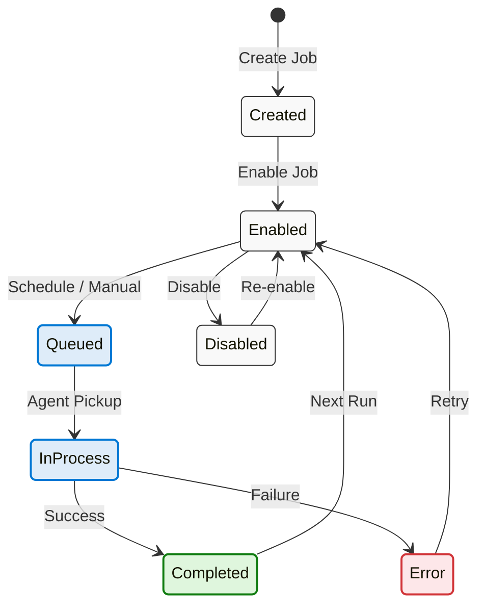

# Operation

This guide covers day-to-day usage of Blazor Data Orchestrator — managing jobs, monitoring execution, and configuring the platform.

---

## Job Lifecycle

---

## Dashboard Overview

The **Home** page displays all jobs in a table with key status indicators:

| Column | Description |
|--------|-------------|
| **Job Name** | Name of the job |
| **Enabled** | Whether the job is active and eligible for scheduling |
| **Queued** | Whether the job is currently queued for execution |
| **In Process** | Whether an agent is currently executing the job |
| **Error** | Whether the last execution encountered an error |

From the dashboard, you can:
- Click a job row to open the **Job Details** dialog
- Click **Create Job** to define a new job
- Use the **Run Job Now** quick action to trigger immediate execution

---

## Creating a Job

1. Click **Create Job** on the home page.
2. Fill in the required fields:
   - **Job Name** — A descriptive name for the job
   - **Organization** — The organization this job belongs to
   - **Environment** — The execution environment (e.g., Development, Production)
3. Click **Save** to create the job.

The new job is created in a disabled state. You need to upload or write code, configure a schedule, and enable the job before it will execute.

---

## Job Details Dialog

The Job Details dialog is the central management interface for each job. It is organized into tabs:

### Details Tab

- **Job Name** — View or edit the job name
- **Enabled** toggle — Enable or disable the job
- **Environment** — Set the execution environment
- **Queue** — Assign the job to a specific queue (e.g., `default`)
- **Run Job Now** button — Queue the job for immediate execution

### Schedules Tab

Configure one or more schedules for the job:

- **Schedule Name** — A label for this schedule
- **Enabled** — Toggle the schedule on/off independently of the job
- **Days** — Select which days of the week the job should run (Mon–Sun)
- **Start Time / Stop Time** — Time window in military format (e.g., `800` to `1700`)
- **Run Every N Hours** — Interval between runs within the time window

### Parameters Tab

Attach key-value data to the job:

- **Field Description** — A label describing the parameter
- **Value** — Supports string, integer, or date values

Parameters are accessible to job code through the execution context.

### Code Tab

Write or upload job code. See the [Online](https://github.com/Blazor-Data-Orchestrator/BlazorDataOrchestrator/wiki/Online) guide for detailed editor usage.

### Webhook Tab

Enable a webhook endpoint for the job:

- Toggle the **Webhook Enabled** switch
- A unique GUID is generated and displayed as the webhook URL
- External systems can trigger the job via `GET` or `POST` to `/webhook/{GUID}`

### Logs Tab

View execution history and log entries:

- Select a **Job Instance** from the dropdown to filter logs
- Each log entry shows: Action, Details, Level, and Timestamp
- Timestamps are adjusted by the configured timezone offset

---

## Running a Job

There are three ways to trigger job execution:

| Method | Description |
|--------|-------------|
| **Scheduled** | The Scheduler service evaluates enabled schedules at a configurable interval (default: 60 seconds). When conditions are met, it creates a JobInstance and queues a message. |
| **Manual** | Click **Run Job Now** on the Details tab or Code tab. This immediately creates a JobInstance and sends a queue message. |
| **Webhook** | An external system sends an HTTP request to `/webhook/{GUID}`. Query parameters are forwarded to the job. |

---

## Monitoring Execution

### Viewing Logs

1. Open the **Job Details** dialog for the job.
2. Navigate to the **Logs** tab.
3. Select the job instance to inspect from the dropdown.
4. Log entries are displayed in a table with columns for Action, Details, Level, and Timestamp.

### Understanding Job Status

| Status | Meaning |
|--------|---------|
| **Queued** | A message has been sent to the Azure Queue but no agent has picked it up yet |
| **In Process** | An agent has received the message and is executing the job |
| **Completed** | Execution finished successfully — the instance is marked complete |
| **Error** | Execution failed or the instance was marked as stuck by the scheduler |

---

## Administration

Navigate to the **Administration** page via the navigation link on the home page.

### Job Groups Tab

- Create and manage organizational groups for categorizing jobs.
- Groups have a name and an active/inactive status.
- Assign jobs to groups for easier filtering and management.

### Job Queues Tab

- Create and manage queue configurations.
- Each queue has a name (e.g., `default`, `jobs-large-container`, `onprem-queue`).
- Assign queues to jobs to route their execution to specific agent pools.
- Deploy agents configured with matching `QueueName` settings to process queue-specific workloads.

### Settings Tab

- **Timezone Offset** — Configure the timezone offset (in hours) for log display. This offset is applied to all timestamps shown in the UI.

---

## Agent Behavior

The Agent is a background worker service that processes job execution messages. Here is what happens when a job is executed:

1. **Poll queue** — The agent polls its configured queue every 5 seconds for new messages.
2. **Receive message** — When a message is received, the visibility timeout is set to 5 minutes.
3. **Download package** — The agent downloads the job's `.nupkg` file from Azure Blob Storage.
4. **Extract & validate** — The package is extracted and validated (checking for `main.cs`/`main.py`, `configuration.json`, etc.).
5. **Resolve dependencies** — For C# jobs, NuGet dependencies declared in the `.nuspec` are resolved using `dotnet restore`.
6. **Load configuration** — The appropriate `appsettings` file is loaded based on the job's environment setting. Connection strings from the agent's configuration are merged in.
7. **Execute code** — C# code is compiled and executed via Roslyn/CS-Script. Python code is executed via subprocess.
8. **Log results** — Execution logs are written to Azure Table Storage.
9. **Update status** — The JobInstance record is updated with completion or error status.
10. **Delete message** — On success, the queue message is deleted. On failure, it becomes visible again after the timeout.

### Visibility Timeout Renewal

For jobs that run longer than 5 minutes, a background task renews the message visibility every 3 minutes. This prevents the message from becoming visible to other agents while the job is still running. If the agent crashes, the message becomes visible after the timeout, allowing another agent to pick it up.

---

*Back to [Home](https://github.com/Blazor-Data-Orchestrator/BlazorDataOrchestrator/wiki/Home)*
