# Requirements

This page lists all prerequisites and infrastructure requirements for running Blazor Data Orchestrator.

---

## Development Prerequisites

| Requirement | Version | Notes |
|------------|---------|-------|
| **.NET SDK** | 10.0+ | Required for building and running all projects |
| **Docker Desktop** (or Podman) | Latest | Required for SQL Server and Azurite containers managed by Aspire |
| **IDE** | Visual Studio 2022+ or Visual Studio Code | VS Code with C# Dev Kit recommended |

> **Important:** Do not install the legacy Aspire workload. Run `dotnet workload restore` from the solution root — this restores only the workloads declared by the solution.

---

## Runtime Infrastructure

Aspire automatically provisions the following infrastructure as containers in development. For production, you provide your own instances or use Azure-hosted equivalents.

### SQL Server

- **Version:** SQL Server 2019+ or Azure SQL Database
- **Port:** 1433 (default)
- **Database:** `blazororchestratordb`
- **Purpose:** Stores all job definitions, schedules, instances, organizations, groups, queues, parameters, and user accounts.

### Azure Storage (or Azurite Emulator)

| Service | Port | Purpose |
|---------|------|---------|
| **Blob Storage** | 10000 | Stores job NuGet packages in the `jobs` container |
| **Queue Storage** | 10001 | Routes job execution messages between Scheduler/Web and Agent |
| **Table Storage** | 10002 | Stores structured job execution logs (`JobLogs` table) and AI settings |

In development, Aspire starts an **Azurite** container that emulates all three Azure Storage services. Data is persisted across restarts via a Docker volume.

---

## Optional: AI Features

To use the AI Code Assistant in the online editor, you need one of the following:

- **OpenAI API key** — Standard OpenAI endpoint
- **Azure OpenAI endpoint** — Azure-hosted OpenAI service with a deployed model

Configure these through the Administration settings in the web UI.

---

## Optional: Python Execution

To execute Python jobs, the Agent host must have:

- **Python 3.x** runtime installed and available on the system PATH

C# job execution does not require any additional runtime beyond the .NET SDK.

---

## Network Requirements

| Port | Service | Direction |
|------|---------|-----------|
| 1433 | SQL Server | Inbound (all app services → SQL) |
| 10000 | Azurite Blob | Inbound (all app services → Blob) |
| 10001 | Azurite Queue | Inbound (all app services → Queue) |
| 10002 | Azurite Table | Inbound (all app services → Table) |
| 443 | NuGet.org | Outbound (Agent → NuGet for dependency resolution) |
| 443 | OpenAI / Azure OpenAI | Outbound (Web → AI service, optional) |

---

## Infrastructure Diagram

```mermaid
graph LR
    %% Styling
    classDef dev fill:#f9f9f9,stroke:#333,stroke-width:2px;
    classDef container fill:#eef6ff,stroke:#0078d4,stroke-width:2px;
    classDef app fill:#0078d4,stroke:#005a9e,stroke-width:2px,color:#fff;

    subgraph "Developer Machine"
        SDK[TOOLS<br/>.NET 10 SDK]:::dev
        DOCKER[HOST<br/>Docker Desktop]:::dev
        IDE[EDITOR<br/>VS / VS Code]:::dev
    end

    subgraph "Containers via Aspire"
        SQLC[🛢️ SQL Server<br/>Port 1433]:::container
        AZURITE[💾 Azurite Storage<br/>Ports 10000-10002]:::container
    end

    subgraph "Application Services"
        WEB[💻 Web App]:::app
        SCHED[⏱️ Scheduler]:::app
        AGENT[🤖 Agent]:::app
    end

    SDK --> WEB & SCHED & AGENT
    DOCKER --> SQLC & AZURITE
    WEB --> SQLC & AZURITE
    SCHED --> SQLC & AZURITE
    AGENT --> SQLC & AZURITE
```

---

*Back to [Home](https://github.com/Blazor-Data-Orchestrator/BlazorDataOrchestrator/wiki/Home)*
