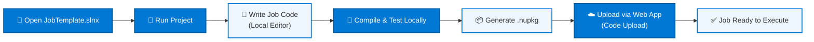

# Visual Studio — Job Creator Template

The **Job Creator Template** is a standalone Blazor project that provides a local development environment for building job packages. It offers the same editing and compilation experience as the online editor, but with full Visual Studio IDE support including debugging, IntelliSense, and source control integration.

---

## Development Flow


```mermaid
flowchart LR
    %% Styling
    classDef action fill:#0078d4,stroke:#005a9e,stroke-width:2px,color:#fff
    classDef state fill:#eef6ff,stroke:#0078d4,stroke-width:2px

    A["📂 Open JobTemplate.slnx"]:::action --> B["🚀 Run Project"]:::action
    B --> C["📝 Write Job Code<br/>(Local Editor)"]:::state
    C --> D["🔨 Compile & Test Locally"]:::action
    D --> E["📦 Generate .nupkg"]:::state
    E --> F["☁️ Upload via Web App<br/>(Code Upload)"]:::action
    F --> G["✅ Job Ready to Execute"]:::state
```

---

## Getting Started

1. **Open the solution** — Open `JobTemplate.slnx` in Visual Studio 2022+.
2. **Run the project** — Press `F5` to launch the Job Creator Template. It opens a local Blazor app with an embedded Monaco editor.
3. **Write code** — Use the editor to write and test your job code.
4. **Compile** — Click **Save & Compile** to validate the code and generate a `.nupkg` package.

---

## Project Structure

| File / Folder | Purpose |
|---------------|---------|
| `Components/Pages/Home.razor` | Main editor page with Monaco editor |
| `Code/` | Template code files and compilation support |
| `Services/` | Compilation and packaging services |
| `appsettings.json` | Default job configuration |
| `appsettingsProduction.json` | Production configuration overrides |


---

## When to Use Visual Studio vs Online Editor

| Scenario | Recommended Approach |
|----------|---------------------|
| Quick edits or simple scripts | [Online Editor](https://github.com/Blazor-Data-Orchestrator/BlazorDataOrchestrator/wiki/Online) |
| Complex multi-file projects | Visual Studio |
| Debugging with breakpoints | Visual Studio |
| No local development tools available | [Online Editor](https://github.com/Blazor-Data-Orchestrator/BlazorDataOrchestrator/wiki/Online) |
| Team collaboration via source control | Visual Studio |

---

## AI Chat Editor

The Job Creator Template includes a built-in **AI Chat Editor** powered by [GitHub Copilot](https://github.com/features/copilot). The chat panel appears alongside the Monaco code editor and can help you write, debug, and improve your job code.

### Configuring the AI Model

Click the **⚙ settings** button in the Chat panel header to open the configuration dialog. Here you can select the Copilot model and refresh the list of available models:

### Copilot CLI Requirement

The AI Chat feature requires the **GitHub Copilot CLI** to be installed and authenticated on your machine. If the CLI is not detected, the chat panel displays a warning banner with setup instructions:


### Installing the Copilot CLI

1. **Install** — Download from [docs.github.com/en/copilot/how-tos/copilot-cli/install-copilot-cli](https://docs.github.com/en/copilot/how-tos/copilot-cli/install-copilot-cli) or run:
   ```
   winget install GitHub.Copilot
   ```
2. **Verify** — Confirm the install succeeded:
   ```
   copilot --version
   ```
3. **Authenticate** — Sign in using one of these methods:
   - `copilot login`
   - Set the `GITHUB_TOKEN` environment variable
   - `gh auth login` (if GitHub CLI is installed)
4. **Restart** the Job Creator Template application.

> **Firewall note:** Ensure outbound HTTPS to `api.githubcopilot.com` is allowed.

Once the CLI is installed and authenticated, the warning banner disappears and the AI Chat editor is ready to use.

## Screenshots - Installing the Copilot CLI


---

*Back to [Job Development](https://github.com/Blazor-Data-Orchestrator/BlazorDataOrchestrator/wiki/Job-Development) · [Home](https://github.com/Blazor-Data-Orchestrator/BlazorDataOrchestrator/wiki/Home)*
