# Visual Studio — Job Creator Template

The **Job Creator Template** is a standalone Blazor project that provides a local development environment for building job packages. It offers the same editing and compilation experience as the online editor, but with full Visual Studio IDE support including debugging, IntelliSense, and source control integration.

---

## Development Flow

```mermaid
flowchart LR
    %% Styling
    classDef action fill:#0078d4,stroke:#005a9e,stroke-width:2px,color:#fff
    classDef state fill:#eef6ff,stroke:#0078d4,stroke-width:2px

    A["📂 Open JobTemplate.slnx"]:::action --> B["🚀 Run Project"]:::action
    B --> C["📝 Write Job Code<br/>(Local Editor)"]:::state
    C --> D["🔨 Compile & Test Locally"]:::action
    D --> E["📦 Generate .nupkg"]:::state
    E --> F["☁️ Upload via Web App<br/>(Code Upload)"]:::action
    F --> G["✅ Job Ready to Execute"]:::state
```

---

## Getting Started

1. **Open the solution** — Open `JobTemplate.slnx` in Visual Studio 2022+.
2. **Run the project** — Press `F5` to launch the Job Creator Template. It opens a local Blazor app with an embedded Monaco editor.
3. **Write code** — Use the editor to write and test your job code.
4. **Compile** — Click **Save & Compile** to validate the code and generate a `.nupkg` package.

---

## Project Structure

| File / Folder | Purpose |
|---------------|---------|
| `Components/Pages/Home.razor` | Main editor page with Monaco editor |
| `Code/` | Template code files and compilation support |
| `Services/` | Compilation and packaging services |
| `appsettings.json` | Default job configuration |
| `appsettingsProduction.json` | Production configuration overrides |

---

## Development Workflow

1. **Write job code** in the local Monaco editor or directly in Visual Studio.
2. **Add NuGet dependencies** by editing the `.nuspec` file or using `//css_nuget` directives.
3. **Compile** to verify the code compiles without errors.
4. **Export the `.nupkg`** file generated by the compilation step.
5. **Upload** the package to the main application:
   - Open the Job Details dialog in the web application.
   - Navigate to the **Code Tab**.
   - Switch to **Code Upload** mode.
   - Upload the `.nupkg` file.
6. The job is now ready to execute.

---

## When to Use Visual Studio vs Online Editor

| Scenario | Recommended Approach |
|----------|---------------------|
| Quick edits or simple scripts | [Online Editor](https://github.com/Blazor-Data-Orchestrator/BlazorDataOrchestrator/wiki/Online) |
| Complex multi-file projects | Visual Studio |
| Debugging with breakpoints | Visual Studio |
| No local development tools available | [Online Editor](https://github.com/Blazor-Data-Orchestrator/BlazorDataOrchestrator/wiki/Online) |
| Team collaboration via source control | Visual Studio |

---

## Screenshots

---

*Back to [Job Development](https://github.com/Blazor-Data-Orchestrator/BlazorDataOrchestrator/wiki/Job-Development) · [Home](https://github.com/Blazor-Data-Orchestrator/BlazorDataOrchestrator/wiki/Home)*
